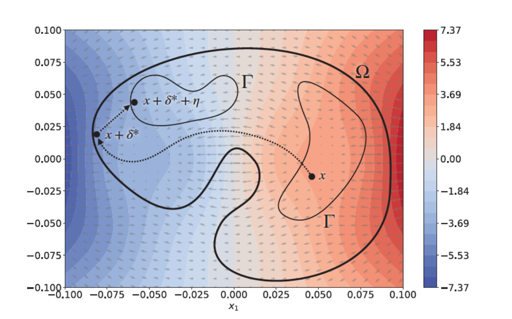
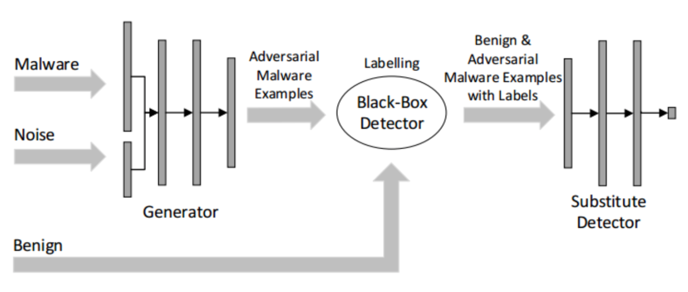
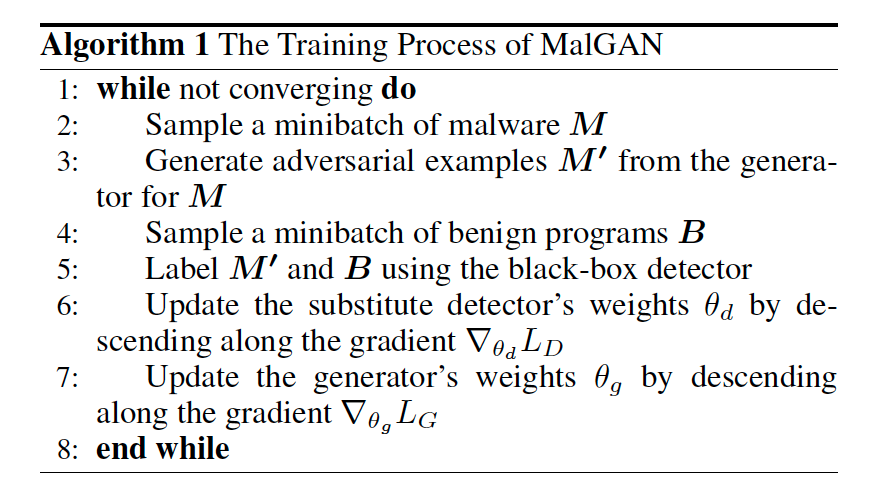
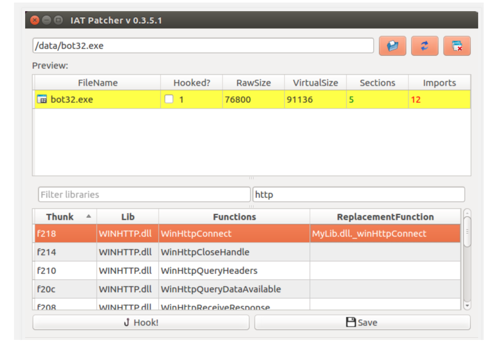
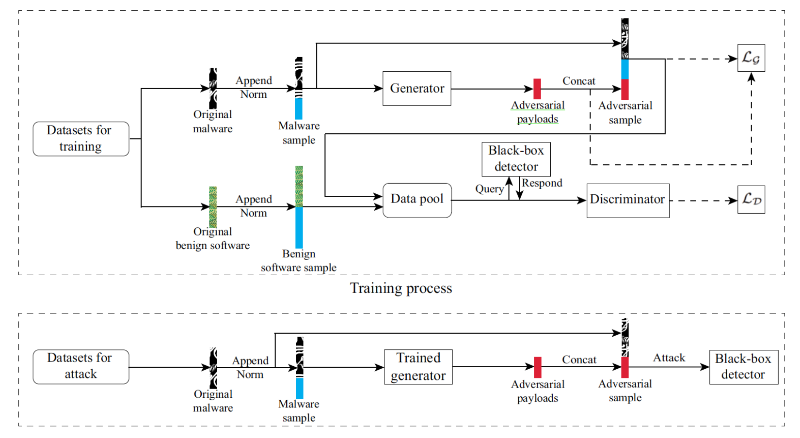
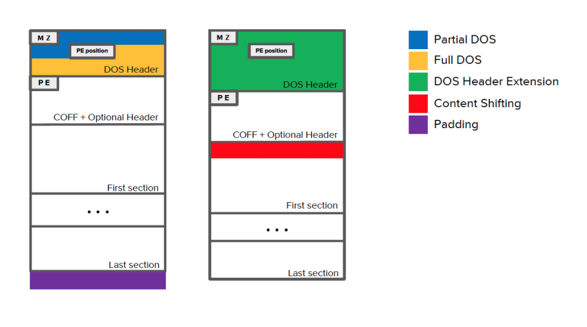

### 基于GAN的恶意软件对抗样本生成

#### 一、背景意义

##### **1.1 简述恶意软件检测发展现状**

**1.2 恶意软件领域相比图像领域增加的约束**

在过去**六年发表的1600多篇**关于对抗ML的论文中，大约有**40篇**集中在恶意软件上，其中大部分集中在**特征空间**上

+ https://nicholas.carlini.com/writing/2019/all-adversarial-example-papers.html

##### 1.2.1 Evading Machine Learning Malware Detection

+ 2017 blackhat

+ https://github.com/drhyrum/gym-malware

+ **PE文件(特征空间)进行少量的修改，这些修改不会破坏PE文件格式，也不会改变代码的执行**

1. **添加一个不使用的API函数+更新导入地址表**
2. 操作现有的section name
3. 添加一个新的节区
4. 将部分字节添加到节区的额外空间
5. 创建一个新的入口点，它会立即跳到原来的入口点
6. 修改/删除签名
7. 修改调试信息
8. 打包或解包文件
9. 修改或删除头部检验
10. 添加字节到PE文件末尾

##### 1.2.2 Intriguing Properties of Adversarial ML Attacks in the Problem Space

+ 2020  SP

+ 揭示了特征空间和问题空间之间的关系，并引入了副作用特征的概念作为反特征映射问题的副产品
+ 四种常见于任何问题空间攻击的主要约束类型:(除了攻击目标函数外，所考虑的问题空间域还可能带有对特征向量修改的约束)
  + **可用转换**：在图像域中，像素的值必须限定在0和255之间,在软件领域中（2017 blackhat）
  + 保留语义：**Misleading authorship attribution of source code using adversarial learning（2020 SP)**
  + 似然性：程序要看起来是手动编写的
  + 对预处理的鲁棒性：程序的死代码删除
  + **附加特征**：为API调用插入有效参数，以及为其调用导入依赖项。这些特征**不遵循任何特定的梯度方向**，因此它们可能对分类得分产生积极或消极的影响

+ **投影类比：**攻击者首先在对象x的特征空间中进行基于梯度的攻击，从而得到一个特征向量 $$x+δ$$，该特征向量被分类为负数，具有很高的可信度。然而，这一点不在约束条件Γ的可行性空间中，后者比Ω的约束条件更为严格。因此，攻击者需要找到一个投影，将$$ x+δ^*$$ 映射回可行的问题空间区域，从而增加副作用特征向量 



##### 1.2.3 A survey on practical adversarial examples for malware classifiers

#### 二、核心内容

##### <u> 2.1 Generating Adversarial Malware Examples for Black-Box Attacks Based on GAN</u>

+ 2017 abs 第一篇

+ **复现**：[Malware-GAN](https://github.com/yanminglai/Malware-GAN)

+ **框架**：
+ API序列提取方式：**CuckooAPI（cuckoo 接口）** -> json报告 ->  API_list.txt -> 特征（0，1）

```python
import CuckooAPI
api = CuckooAPI.CuckooAPI("172.29.226.111", APIPY=True, port=8090)
api.submitfile("*.exe")
```

+ 框架描述

+ 一个API序列表示一个软件

  

+ 实验结果分析

+ 缺点分析

  + 只停留在特征空间，没有生成问题空间

+ 解决方案

  + [IAT_patcher](http://hasherezade.github.io/IAT_patcher/)：IAT hooking application 根据API对抗特征（特征空间）生成对抗可执文件（问题空间）

    

+ 笔记博客

  + https://blog.csdn.net/jmh1996/article/details/102972421
  + https://www.zybuluo.com/wuxin1994/note/881171

##### **2.2 Generic blackbox end-to-end attack against state of the art API call based malware classifiers**

+ 2018 RAID

+ 提出了一种基于API序列调用分析的针对Windows恶意软件分类器的黑盒对抗式攻击，这种规避策略也适用于类似的Android分类器除了对基于API的序列特征的有限关注外，它们的问题空间变换留下了两个主要的工件，可以通过程序分析：添加无操作指令（no ops）和修补导入地址表（IAT）。首先，插入的API调用需要在运行时执行，因此包含作者按照“默默无闻的安全”实践硬编码的单个no ops，这是已知无效的[19，37]；直观地说，可以通过识别攻击者用于执行no OPAPI调用的技巧来检测和删除它们（例如。，读取0字节），或者在将动态执行序列馈送到分类器之前，从动态执行序列中过滤“死”API调用（即，没有执行任何实际任务）。其次，为了避免需要访问源代码，新的API调用被插入并使用IAT补丁调用。然而，所有新的API必须包含在二进制文件的一个单独的段中，并且由于IAT修补是恶意软件作者使用的一种已知的恶意策略[25]，IAT对非标准动态链接器的调用或从IAT到二进制文件内部段的多次跳转将立即被识别为可疑。
+ Practical black-box attacks against machine learning
  + 使用基于雅可比矩阵的数据集扩充
+ [IAT_patcher](http://hasherezade.github.io/IAT_patcher/)

##### 2.3 Black-Box Adversarial Attacks Against Deep Learning Based Malware Binaries Detection with GAN

+ 2020 ECAI

+ 框架：



#### 问题：

+ 为什么要用GAN生成对抗样本？
  + 在图像领域出色的模仿能力
  + 在我们的模型中，一旦GANs的训练过程完成，生成器就可以在很短的时间内用输入的恶意软件二进制文件独立生成恶意软件对抗样本。
  + [GAN生成对抗样本的方法解析](https://www.sohu.com/a/405844314_500659) (advGAN)

检测模型：

Activation analysis of a byte-based deep neural network for malware classification （SPW)

对抗样本：

Efficient black-box optimization of adversarial windows malware with constrained manipulations

Aimed: Evolving malware with genetic programming to evade detection

Adversarial malware binaries: Evading deep learning for malware detection in executables.(2018 EUSIPCO)

Optimization-guided binary diversification to mislead neural networks for malware detection

Exploring adversarial examples in malware detection.

### ytt流程：

#### 一、背景意义

##### 1.1 恶意软件发展现状

+ 每天恶意软件增长数量
+ 很多安全公司使用机器学习的检测模型
  + 基于签名的检测 ，只能防御已知的攻击
    + Processing virus collections. VIRUS 129 (2001), 129–134
  + 机器学习（**特征空间**）：预测新的输入，无监督对相同的家族进行聚类
  + 深度学习（问题空间）：
    + Malware Images: Visualization and Automatic Classification （2011）
    + Malware Detection by Eating a Whole EXE (2018)
+ 机器学习模型的脆弱性->恶意软件对抗样本这些研究指出，深度学习算法和人工智能应用的安全性受到严重威胁
  + Intriguing properties of neural networks （2013）
  + Explaining and harnessing adversarial examples（2015 goodflow）
  + Adversarial camera stickers: A physical camera-based attack on deep learning systems
  + Transferable adversarial attacks for image and video object detection （2019 IJCAI）

##### 1.2 恶意软件对抗样本的约束

+ 对抗性例子的概念在[72]中首次提出，并在[28]中得到扩展。
  + 举例**图像**和**文本**的对抗样本举例（1600多篇对抗样本攻击中大约40片恶意代码的，大部分**特征空间**）
  + *Pierazzi*定义了两种搜索策略
    + 梯度驱动：对码扰动对梯度的影响进行了**近似**，并用它来跟踪梯度的方向
    + 问题驱动：一种问题驱动的方法，在采用进化方法之前，首先**随机突变**。[6]强化学习

##### Evading Machine Learning Malware Detection

+ 2017 blackhat

+ https://github.com/drhyrum/gym-malware

+ **PE文件(特征空间)进行少量的修改，这些修改不会破坏PE文件格式，也不会改变代码的执行**

1. **添加一个不使用的API函数+更新导入地址表**
2. 操作现有的section name
3. 添加一个新的节区
4. 将部分字节添加到节区的额外空间
5. 创建一个新的入口点，它会立即跳到原来的入口点
6. 修改/删除签名
7. 修改调试信息
8. 打包或解包文件
9. 修改或删除头部检验
10. 添加字节到PE文件末尾

​		摘要近年来，对抗性多目标攻击的研究主要集中在问题空间攻击上，主要集中在与图像不同的是，在特征空间（如软件）没有清晰的逆映射的领域中生成真实的规避目标。问题空间攻击的设计、比较和现实意义仍然没有得到充分的探讨。

​		揭示了特征空间与问题空间的关系，引入了副作用特征作为逆特征映射问题的副产品的概念。

+ 与图片领域的对抗样本的区别

+ 生成对抗样本的方式（可用转换）
+ 生成的对抗样本（保留语义）
+ 似然性（人看起来不明显）

#### 二、实验过程

+ MalGAN框架

  + 假设恶意软件作者所知道的关于黑盒探测器的唯一信息就是它使用了什么样的功能
  + 恶意软件的作者能够从黑盒探测器中得到他们程序的检测结果

+ **实验流程**

  + 前提假设

    （1）假设恶意软件作者所知道的关于黑盒探测器的唯一信息就是它使用了什么样的功能

    （2）恶意软件的作者能够从黑盒探测器中得到他们程序的检测结果

  + 数据预处理

    PE文件调用 CuckooAPI（cuckoo接口） -> json报告 -> API_list.txt -> 特征（0，1）160维

  + 训练完成黑盒模型

  + 对抗训练

    + 生成对抗样本
    + 优化一次代替模型
    + 优化一次生成模型
    + 生成对抗样本

#### 三、实验结果

+ 实验结果分析
  + 18万，30%malware，API特征（160维）
  + blackbox（随机森林、逻辑回归、决策树、支持向量机、多层神经网络，集成学习）
  + 相同的数据集，不同的数据集
+ 实验缺点分析
  + 在特征空间中进行操作，实际上从未创建恶意二进制文件，而只是将其作为特征向量传递给受攻击的模型。
  + IATpatch （hook API注入）

#### 四、思考与总结

+ 软件对抗样本的约束性

  ##### Intriguing Properties of Adversarial ML Attacks in the Problem Space

  + 2020  SP

  + 揭示了特征空间和问题空间之间的关系，并引入了副作用特征的概念作为反特征映射问题的副产品
  + 四种常见于任何问题空间攻击的主要约束类型:(除了攻击目标函数外，所考虑的问题空间域还可能带有对特征向量修改的约束)
    + **可用转换**：在图像域中，像素的值必须限定在0和255之间,在软件领域中（2017 blackhat）
    + 保留语义：**Misleading authorship attribution of source code using adversarial learning（2020 SP)**
    + 似然性：程序要看起来是手动编写的
    + 对预处理的鲁棒性：程序的死代码删除
    + **附加特征**：为API调用插入有效参数，以及为其调用导入依赖项。这些特征**不遵循任何特定的梯度方向**，因此它们可能对分类得分产生积极或消极的影响

  + **投影类比：**攻击者首先在对象x的特征空间中进行基于梯度的攻击，从而得到一个特征向量 $$x+δ$$，该特征向量被分类为负数，具有很高的可信度。然而，这一点不在约束条件Γ的可行性空间中，后者比Ω的约束条件更为严格。因此，攻击者需要找到一个投影，将$$ x+δ^*$$ 映射回可行的问题空间区域，从而增加副作用特征向量 $$η$$.

  

  **Adversarial EXEmples: A Survey and Experimental Evaluation of Practical Attacks on Machine Learning for Windows Malware Detection**

  - 为了保留恶意功能，以前的攻击要么将**字节添加到文件的现有非功能区域**，从而可能限制其有效性，要么需要运行计算要求很高的**验证步骤来丢弃在沙盒环境中无法正确执行的恶意软件变体**。
  - 很多安全公司使用了机器学习的检测模型

  1. https://www.sophos.com/products/intercept-x/tech-specs.aspx
  2. https://www.fireeye.com/blog/products-and-services/2018/07/malwareguard-fireeye-machine-learning-model-to-detect-and-prevent-malware.html
  3. https://www.kaspersky.com/enterprise-security/wiki-section/products/machine-learning-in-cybersecurity
  4. https://www.avast.com/technology/ai-and-machine-learning

  - **与其他问题领域（如图像分类）中的对抗性规避攻击不同，在保留恶意负载的同时操纵恶意软件可能很难实现。尤其是，在攻击过程中对输入字节的每一次扰动都可能导致底层语法、语义或结构的变化，从而阻止二进制执行其预期目标。为解决此问题，攻击者可以采取以下两种方法之一：**应用侵入性扰动并使用动态分析方法（如仿真）以确保二进制文件的功能不受损害**[4，23]，或**将扰动集中在不影响功能的文件区域**[7，8，13，16，24]（如追加字节）。很自然，这会导致在一个极端的强大但耗时的攻击和另一个极端的较弱但计算效率更高的攻击之间进行权衡。**

  

+ 面临的挑战

  + 实验结果被放大，**检测器特征单一**，没有对恶意软件样本进行高级分析
  + 逆映射的困难

+ Github

  + 程序代码

+ 未来工作

  + 问题空间中的恶意软件对抗样本
    + 有更多的空间去增加扰动
  + GAN在恶意软件检测中的其他应用
  + 云沙箱-恶意软件检测平台

------

**附录：**

A: Blackhat

B: ImportAddressTable


+ IAT 和 沙箱api的区别
+ 什么是IAT、沙箱
+ 恶意软件对抗样本类型

基于签名的检测【51】


Extended Abstract: Toward Systematically Exploring Antivirus Engines. （2018 DIVWA）

鲁棒性：

+ Adversarial Deep Learning for Robust Detection of Binary Encoded Malware. In 2018 IEEE Security and Privacy Workshops (SPW).

+ Adversarial Deep Ensemble: Evasion Attacks and Defenses for Malware Detection （顶刊 IEEE Transactions on Information Forensics and Security (2020)）

混淆和对抗样例的关系
